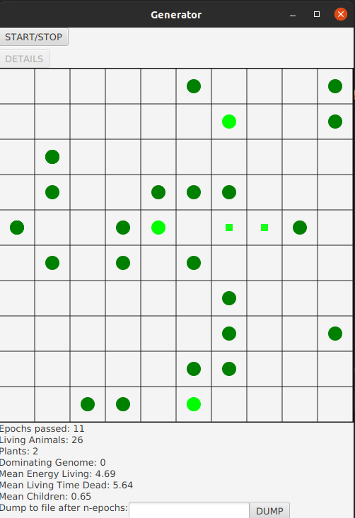
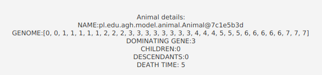

## Evolutionary Generator

Project for OOP course.

Details and description are [here](https://github.com/apohllo/obiektowe-lab/blob/master/lab8/Readme.md).

## Short description

Applications simulates lives of animals in a world. They can eat plants, move, copulate and die.
Animals are marked as circles(color depends on their energy level). When an animal eats plants its energy growths.
Movement and copulation costs energy. When energy level falls below 0, the animal dies.

On the bottom there are statistics of the simulation, that can be dumped to json file.

It is possible to stop the simulation and see details of selected animal, and then continue the simulation.

It is possible to start multiple, independent simulations in the starting window by clicking `NEW SIMULATION`

## How to run
- import into Intellij
- on the right bar: Gradle -> Tasks -> application -> run

## Auxiliary information
- parameters are in `parameters.json`
- statistics will dump into `stats.json`

